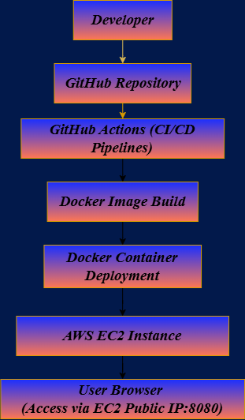

# **CI/CD Docker Deployment on AWS EC2 using GItHub Actions**
This Projects demonstrates a complete **CI/CD Pipeline** for automatically deploying a dockerized web application to an AWS EC2 instance using **GitHub Actions**.

Whenever code is pushed to GitHub repository, the pipeline automatically connects to the EC2 server, rebuilds the docker image, and redeploys the container.

## **Project Architecture**
```
       Developer
          ↓
    GitHub Repository
          ↓
GitHub Actions CI/CD Pipelines
          ↓
SSH Deployment to AWS EC2
          ↓
   Docker Image Build
          ↓
Docker Container (Nginx)
          ↓
    AWS EC2 Instance
          ↓
      User Browser
(Access via EC2-public-IP:8080)
```

## **Technologies Used**
- AWS EC2 
- Docker
- GitHub Actions
- Nginx
- SSH Automation
- CI/CD Pipeline

## **Project Workflow**
1. Developer pushes code to GitHub
2. GitHub Actions pipeline is triggered automatically
3. The pipeline connects to the EC2 server via SSH
4. Latest code is pulled from the repository
5. Docker image is rebuilt
6. Existing container is stopped and removed
7. New container is deployed
8. Updated website becomes available via EC2 Public IP

## **CI/CD Pipelines Script**
```
cd ci-cd-docker-aws-deployment
git pull origin main
cd app

docker stop web-container || true
docker rm web-container || true

docker build --no-cache -t devops-web .
docker run -d -p 8080:80 --name web-container devops-web
```

## **Application**
The application is a simple HTML website served through an Nginx Docker Container.
### Access Via:
```
http://<ec2-public-ip>:8080
```
## **Key DevOps Concepts Demonstrated**
- Continuous Integration
- Continuous Deployment
- Containerized Application
- Infrastructured Automation
- Remote Server Deployment via SSH
- Automated Docker Builds

## **Future Improvements**
- DockerHub Image Registry Integration
- Kubernetes Deployment
- Infrastructure provisioning using Terraform
- Monitoring using Prometheus & Grafan

## **Author**
Bijendra Kumar Deori

Aspiring CloudOps/ DevOps Engineer
