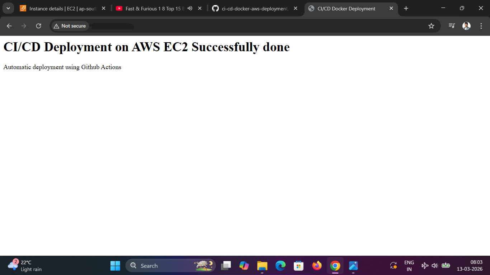

# **CI/CD Docker Deployment on AWS EC2 using GItHub Actions**
This Projects demonstrates a complete **CI/CD Pipeline** for automatically deploying a dockerized web application to an AWS EC2 instance using **GitHub Actions**.

Whenever code is pushed to GitHub repository, the pipeline automatically connects to the EC2 server, rebuilds the docker image, and redeploys the container.

## **Project Architecture**
```
       Developer
          ↓
    GitHub Repository
          ↓
GitHub Actions CI/CD Pipelines
          ↓
SSH Deployment to AWS EC2
          ↓
   Docker Image Build
          ↓
Docker Container (Nginx)
          ↓
    AWS EC2 Instance
          ↓
      User Browser
(Access via EC2-public-IP:8080)
```

## **Technologies Used**
- AWS EC2 
- Docker
- GitHub Actions
- Nginx
- SSH Automation
- CI/CD Pipeline

## **Project Workflow**
1. Developer pushes code to GitHub
2. GitHub Actions pipeline is triggered automatically
3. The pipeline connects to the EC2 server via SSH
4. Latest code is pulled from the repository
5. Docker image is rebuilt
6. Existing container is stopped and removed
7. New container is deployed
8. Updated website becomes available via EC2 Public IP

## **CI/CD Pipelines Script**
```
cd /home/ubuntu/ci-cd-docker-aws-deployment

git fetch origin
git reset --hard origin/main

docker stop web-container || true
docker rm -f web-container || true
docker build --no-cache -t devops-web .
docker run -d -p 8080:80 --name web-container devops-web

```
## **GitHub Secrets Used**
```
- EC2_HOST -Public IPv4 address of the EC2 Instance
- EC2_USER - SSH username for the EC2 Instance (ubuntu)
- EC2_SSH_KEY - Private SSH key used for secure access
```
## **Challenges and Fixes**
- The CI/CD pipeline was working successfully earlier.
- Later, the project files were reorganized from the 'app/' folder to the repository root to simplify the Docker build context and deployment structure.
- After the folder move, the deployment workflow still needed to be aligned with the updated file location and build context.
- This required correcting the deployment workflow, so Docker could build and run the application from the root directory.
- Another issue occured because the EC2 instance was using non-elastic IP.
- After the instance restart, the public IP changed,which made the 'EC2_HOST' value in GitHub Actions secret outdated.
- This caused SSh connection timeout during deployment.
- The issue was resolved by updating the workfolw where needed and then updating the 'EC2_HOST' secret with the latest EC2 public IP address.
- After these fixes, the GitHub Actions workflow successfully deployed the application again.

## **Application Output**
After successful CI/CD pipeline execution, the Docker container is deployed automatically on the AWS EC2 instance.

### Access Via:
```
http://<ec2-public-ip>:8080
```

### Deployment Result


## **Key DevOps Concepts Demonstrated**
- Continuous Integration
- Continuous Deployment
- Containerized Application
- Infrastructure Automation
- Remote Server Deployment via SSH
- Automated Docker Builds

## **Future Improvements**
- DockerHub Image Registry Integration
- Kubernetes Deployment
- Infrastructure provisioning using Terraform
- Monitoring using Prometheus & Grafana

## **Author**
Bijendra Kumar Deori

Aspiring CloudOps/ DevOps Engineer
